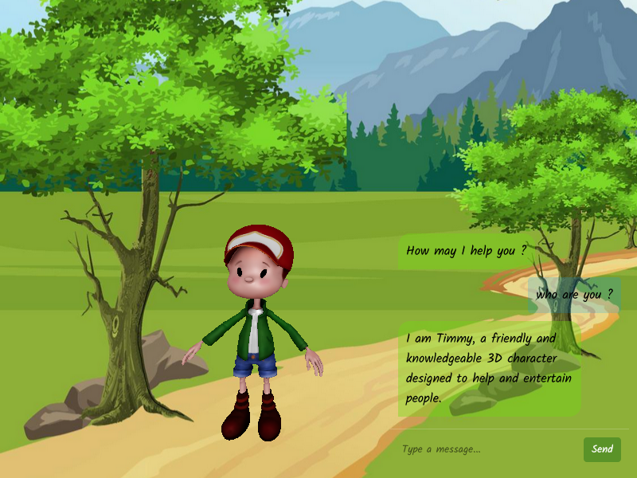

# Timmy Character Animation

This project implements a 3D character named Timmy using Three.js. Timmy features various animations, including idle, walking, and greeting, allowing for interactive chat-like behavior.

  <!-- Include the image from the root directory -->

## Demo

Check out the live demo of Timmy in action [here](https://timmy-bro.vercel.app/).

## Features

- **Character Animation**: Timmy can perform multiple animations like idle, walk, greeting, and talking.
- **Animation Control**: Easily manage animation sequences, including playing animations in response to user interactions.
- **Random Idle Animation**: Timmy plays random idle animations while waiting for user input.
- **Event Listeners**: The character responds to user clicks and animation events.

## Technologies Used

- [Three.js](https://threejs.org/)
- JavaScript
- HTML5

## Getting Started

To get a local copy of this project up and running, follow these simple steps:

1. **Clone the repository**:

   ```bash
   git clone https://github.com/yourusername/timmy-character-animation.git
